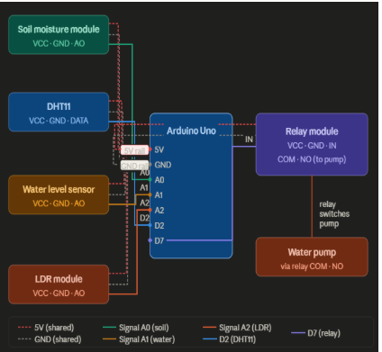
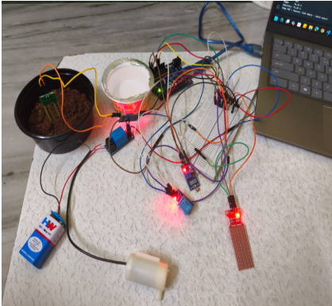
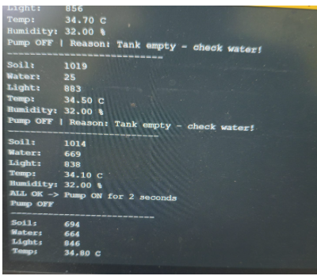

# Smart Automated Irrigation System

An Arduino-based automated irrigation system that uses four sensors to intelligently control a water pump with no manual intervention needed.

---

##  Abstract

This project presents an automated irrigation system that uses four sensors: soil moisture, temperature and humidity (DHT11), water level, and light intensity (LDR) connected to an Arduino Uno microcontroller.

The system monitors soil dryness, ambient temperature, available water in the tank, and time of day (via light detection) to intelligently control a water pump through a relay module.

The pump activates only when the soil is dry, water is available in the tank, and it is daytime ensuring efficient and autonomous plant watering without manual intervention.

---

##  Project Photos


*Circuit diagram*


*Full hardware setup*


*System in action*

---

## Components Used

| Component | Quantity |
|---|---|
| Arduino Uno | × 1 |
| Soil moisture sensor module | × 1 |
| DHT11 temperature and humidity sensor | × 1 |
| Water level sensor | × 1 |
| LDR sensor module | × 1 |
| Single channel relay module | × 1 |
| Mini submersible water pump | × 1 |
| Breadboard | × 1 |
| Jumper wires | × ~20 |

---

## How It Works

```
IF soil is dry
AND water is available in tank
AND it is daytime (light detected)
THEN turn pump ON
ELSE pump OFF
```

| Sensor | Pin | Purpose |
|---|---|---|
| Soil moisture | A0 | Detects if soil is dry |
| Water level | A1 | Ensures tank is not empty |
| LDR module | A2 | Detects daytime vs night |
| DHT11 | D2 | Reads temperature and humidity |
| Relay | D7 | Switches pump ON/OFF |

---

## Wiring Summary

All sensor modules share the Arduino's **5V** and **GND** pins via the breadboard power rails. Only the signal wires connect to individual Arduino pins.

- Soil moisture AO → A0  
- Water level AO → A1  
- LDR module AO → A2  
- DHT11 DATA → D2  
- Relay IN → D7  

---

## Sensor Test Values

| Sensor | Expected reading |
|---|---|
| Soil moisture (dry) | ~600–900 |
| Soil moisture (wet) | ~200–400 |
| Water level (in water) | ~400–700 |
| Water level (no water) | ~0–50 |
| LDR (bright light) | ~600–900 |
| LDR (covered) | ~50–200 |
| DHT11 | ~25–35°C |

---
